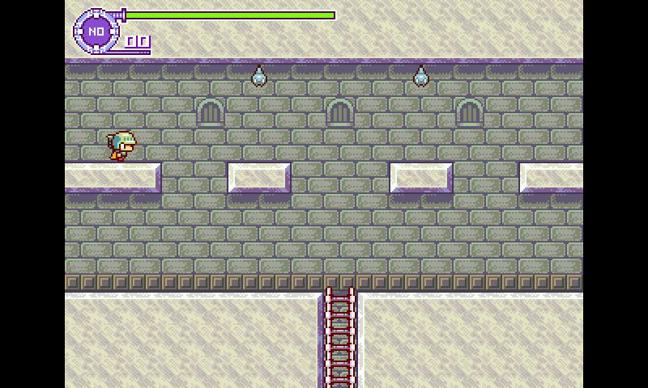

# Hydra Castle Labyrinth

This version of Hydra Castle Labyrinth is based on the 3DS port (see below for original notice)

This vertsion use SDL (1.2) and build on Linux & OpenPandora.

You'll need SDL 1.2 and SDL_mixer to build

# Original Notice

**This work has been done by an anon from /hbg/ on 4chan.org/vg/ and not me!**

I've asked the original author about what license to use and he allowed me to use the GPLv2.
Therefore consider each file to be licensed under the GPLv2, even if there is no disclaimer inside of each file.
You will have gotten a copy of the license as part of the git and if not, get a copy from `https://www.gnu.org/licenses/gpl-2.0.html`.

Original author notes:
Source code for the fan-made port of Hydra Castle Labyrinth for 3DS

Anything related to the PSP and Wii are unfinished.

(Yes, it does look like a 3rd grader programmed this.)

The game's originally done by E.Hashimoto (a.k.a. Buster).
You can download some of his works under this [link](http://hp.vector.co.jp/authors/VA025956/).
